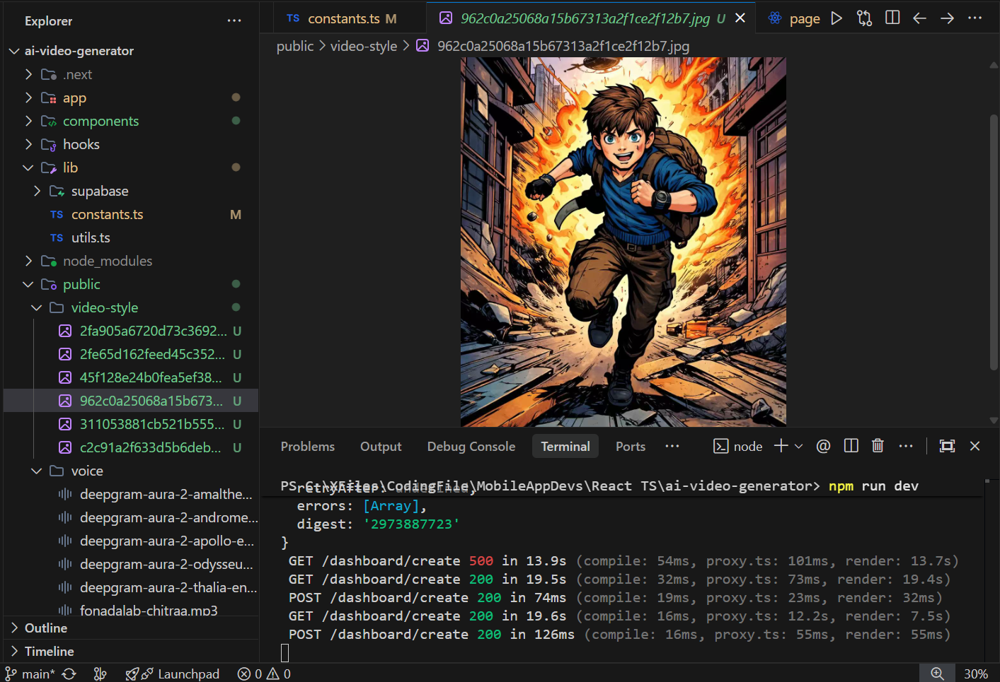

  # Zynova - AI Short Video Generator

<div align="center">
  


**Create Viral Short-Form Videos with the Power of AI**

[](https://nextjs.org/)
[](https://www.typescriptlang.org/)
[](https://tailwindcss.com/)
[](https://supabase.com/)
[](https://clerk.com/)
[](https://deepmind.google/technologies/gemini/)
[](https://www.inngest.com/)

</div>

---

## 🚀 Overview

**Zynova** is a cutting-edge web application designed to revolutionize content creation. It empowers users to generate high-quality, viral-ready short videos for platforms like YouTube Shorts, Instagram Reels, and TikTok in seconds. By leveraging advanced AI models, Zynova automates the entire production process—from scriptwriting to visual assembly—allowing creators to focus on growth rather than editing.

## ✨ Key Features

- **🤖 Advanced AI Scripting**: Utilizes **Google Gemini AI** to generate engaging, human-like scripts tailored to your specific niche and audience.
- **🎨 Cinematic Visuals**: Automatically orchestrates video scenes with movie-quality imagery and dynamic layouts.
- **🔐 Secure Authentication**: Seamless and secure user management powered by **Clerk**.
- **💾 Robust Data Management**: Scalable database and storage solutions using **Supabase**.
- **⚡ Event-Driven Architecture**: Reliable background job processing for complex video generation tasks using **Inngest**.
- **📱 Responsive Dashboard**: A beautiful, mobile-first UI built with **Radix UI** and **Tailwind CSS**.
- **📊 Interactive Analytics**: Visualize your content strategy with integrated charts (Recharts).

## 🛠️ Tech Stack

### Frontend

- **Framework**: [Next.js 16 (App Router)](https://nextjs.org/)
- **Language**: [TypeScript](https://www.typescriptlang.org/)
- **Styling**: [Tailwind CSS v4](https://tailwindcss.com/), `clsx`, `tailwind-merge`
- **Components**: [Radix UI](https://www.radix-ui.com/), [Shadcn UI](https://ui.shadcn.com/) (derived), [Lucide React](https://lucide.dev/)
- **Animations**: [Framer Motion](https://www.framer.com/motion/)

### Backend & Infrastructure

- **Database**: [Supabase](https://supabase.com/) (PostgreSQL)
- **Authentication**: [Clerk](https://clerk.com/)
- **Serverless Events**: [Inngest](https://www.inngest.com/) for handling async workflows (video generation pipelines).

### Artificial Intelligence

- **LLM**: [Google Generative AI (Gemini)](https://ai.google.dev/) for script generation and creative direction.

## ⚙️ How It Works

1.  **User Input**: The user selects a niche, tone, and specific requirements for their video via the dashboard.
2.  **Script Generation**: The application sends a prompt to **Google Gemini**, which crafts a compelling script and suggests visual scenes.
3.  **Asset Orchestration**: The system determines the best stock imagery or AI-generated visuals to match the script's distinct scenes.
4.  **Processing**: **Inngest** manages the workflow, ensuring that resource-intensive tasks (like fetching assets and formatting data) don't block the user interface.
5.  **Delivery**: The final video project is saved to **Supabase**, where users can view, edit, or export their content.

## 📦 Getting Started

Follow these steps to set up the project locally.

### Prerequisites

- Node.js (v18 or higher)
- npm, yarn, pnpm, or bun

### Installation

1.  **Clone the repository:**

    ```bash
    git clone https://github.com/your-username/ai-video-generator.git
    cd ai-video-generator
    ```

2.  **Install dependencies:**

    ```bash
    npm install
    ```

3.  **Set up Environment Variables:**
    Create a `.env.local` file in the root directory and add the following keys:

    ```env
    # Clerk Auth
    NEXT_PUBLIC_CLERK_PUBLISHABLE_KEY=your_clerk_key
    CLERK_SECRET_KEY=your_clerk_secret

    # Supabase
    NEXT_PUBLIC_SUPABASE_URL=your_supabase_url
    NEXT_PUBLIC_SUPABASE_ANON_KEY=your_supabase_anon_key

    # Google Gemini AI
    GEMINI_API_KEY=your_gemini_api_key

    # Inngest
    INNGEST_EVENT_KEY=your_inngest_key
    INNGEST_SIGNING_KEY=your_inngest_signing_key
    ```

4.  **Run the development server:**

    ```bash
    npm run dev
    ```

5.  **Open the app:**
    Visit [http://localhost:3000](http://localhost:3000) in your browser.

## 🤝 Contributing

Contributions are welcome! Please feel free to submit a Pull Request.

---

<p align="center">
  Built with ❤️ by the Zynova Team
</p>
